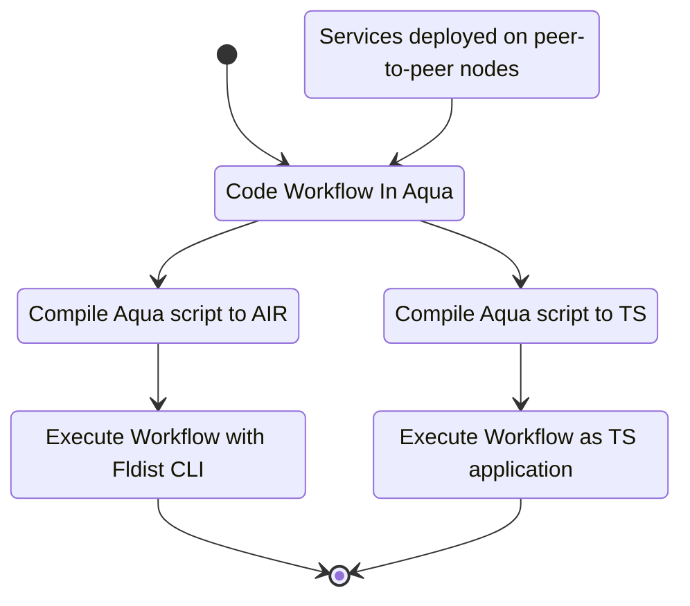

# Aqua Quickstart


Aqua is Fluence Labs' programming language facilitating the composition of applications from distributed, peer-to-peer services. Once an Aqua script is created, it can be compiled to AIR -- a lower language executable by the Aqua VM which resides on every peer-tp-peer node and client. Alternatively, an Aqua script can be compiled to a TypeScript (TS) stub embedding AIR. AIR scripts proper can be executed with the [fldist CLI](https://github.com/fluencelabs/fldist) and TS stubs can be imported into a TypeScript application building on the [JS SDK](https://github.com/fluencelabs/fluence-js). See Figure 1.

Figure 1: Aqua Development And Execution Model



Before we can start coding our workflow in Aqua, we need something to be composed into an application. This something is what we call a service: a logical representation of one or more Wasm modules deployed on one or more peer-to-peer nodes. In order to script a service, we need the Peer ID of each of the nodes hosting the service, the service id of the service and the service exposed API.

For the purpose of this section, we will use a greeting service, which

* has only one exposed function that allows us to to either Hi or Bye an input parameter _name_: "Hi {}" or "Bye {}"
* is hosted on a node with peer id  12D3KooWKnEqMfYo9zvfHmqTLpLdiHXPe4SVqUWcWHDJdFGrSmcA
* has a unique identifier, i.e. service id, c9a315de-4fe2-4730-8f40-9209428383bc

We can check the availability of the service module using the `fldist` tool. In your VSCode terminal run:

```bash
fldist --node-id 12D3KooWKnEqMfYo9zvfHmqTLpLdiHXPe4SVqUWcWHDJdFGrSmcA  get_modules --pretty| grep -B 13 -A 1  greeting
  {
    "config": {
      "logger_enabled": true,
      "logging_mask": null,
      "mem_pages_count": 100,
      "mounted_binaries": null,
      "wasi": {
        "envs": null,
        "mapped_dirs": null,
        "preopened_files": []
      }
    },
    "hash": "9af450928626beefab6c055bd6d6ddb4ae9c59344614cee7083e7be7d5fc93c2",
    "name": "greeting"
  },
root@56892f4726bb:/workspaces/devcontainer/aqua-tutorial#
```

Now that we know that the module underlying our service exists, we can check on its interface(s) also with the`flidst` commandline tool:

```bash
root@56892f4726bb:/workspaces/devcontainer/aqua-tutorial# fldist --node-id 12D3KooWKnEqMfYo9zvfHmqTLpLdiHXPe4SVqUWcWHDJdFGrSmcA  get_interface --id c9a315de-4fe2-4730-8f40-9209428383bc --expand
{
  "function_signatures": [
    {
      "arguments": [
        [
          "name",
          "String"
        ],
        [
          "greeter",
          "Boolean"
        ]
      ],
      "name": "greeting",
      "output_types": [
        "String"
      ]
    }
  ],
  "record_types": []
}
root@56892f4726bb:/workspaces/devcontainer/aqua-tutorial#
```

That is, our service takes a _String_ parameter and a _boolean_ parameter to either return "Hi %name%" or "Bye %name%". With that, we have all the information needed to use our distributed service. 

Create a new directory *aqua-tutorial* in your workspace and add am *aqua* dir so that you have a structure like about so:

```bash
root@56892f4726bb:/workspaces/devcontainer/aqua-tutorial# ls -lrth
total 4.0K
drwxr-xr-x 2 root root 4.0K Jun  1 23:59 aqua
root@56892f4726bb:/workspaces/devcontainer/aqua-tutorial#
```

In the *aqua* dir, add the following Aqua script *greeter.aqua*:

```aqua
-- greeter.aqua                             --< 1
service Local("returnService"):             --< 2
  run: string -> ()

service Greeting("service-id"):             --< 3
    greeting: string, bool -> string

func greeter(name: string, greet: bool, node: string, service_id: string):  --< 4
    on node:                                                      
      Greeting service_id
      res <- Greeting.greeting(name, greet)
    Local.run(res)
```

Basically, we just created a script that instructs the Aqua runtime (Aqua VM) on node *node* to execute the service *service_id* with the parameters *name* and *greet* and then to return the result to the local application. This is all happening in the *greeter* func (4) and uses the service interface representation of the deployed service, *service Greeting* (3) and the *service Local* (2) to accomplish our goal. Note, inline comments in Aqua are prefixed by a double dash *--* (1).

Now that we have our script, let's compile it to AIR. In your *aqua-tutorial* directory, create a dir *air-scripts* and call the aqua compiler:

```bash
root@56892f4726bb:/workspaces/devcontainer/aqua-tutorial# aqua-cli --input aqua --output air-scripts  --air
java -jar /root/.nvm/versions/node/v14.17.0/lib/node_modules/@fluencelabs/aqua-cli/aqua-cli.jar --input aqua --output air-scripts --air

Compiled /workspaces/devcontainer/aqua-tutorial/air-scripts/greeter.greeter.air

root@56892f4726bb:/workspaces/devcontainer/aqua-tutorial#
```

which results in the low level language representation:

```clojure
(xor
 (seq
  (seq
   (seq
    (seq
     (seq
      (seq
       (seq
        (seq
         (call %init_peer_id% ("getDataSrv" "-relay-") [] -relay-)
         (call %init_peer_id% ("getDataSrv" "name") [] name)
        )
        (call %init_peer_id% ("getDataSrv" "greet") [] greet)
       )
       (call %init_peer_id% ("getDataSrv" "node") [] node)
      )
      (call %init_peer_id% ("getDataSrv" "service_id") [] service_id)
     )
     (call -relay- ("op" "identity") [])
    )
    (xor
     (call node (service_id "greeting") [name greet] res)
     (seq
      (call -relay- ("op" "identity") [])
      (call %init_peer_id% ("errorHandlingSrv" "error") [%last_error% 1])
     )
    )
   )
   (call -relay- ("op" "identity") [])
  )
  (call %init_peer_id% ("returnService" "run") [res])
 )
 (call %init_peer_id% ("errorHandlingSrv" "error") [%last_error% 2])
)
```

Needless to say, writing Aqua scripts has its definitive advantages over writing low level AIR scripts by hand.

Using `fldist`, we can execute the AIR script:

```bash
root@56892f4726bb:/workspaces/devcontainer/aqua-tutorial# fldist --node-id 12D3KooWKnEqMfYo9zvfHmqTLpLdiHXPe4SVqUWcWHDJdFGrSmcA run_air -p air-scripts/greeter.greeter.air  -d '{"service_id":"c9a315de-4fe2-4730-8f40-9209428383bc", "node": "12D3KooWKnEqMfYo9zvfHmqTLpLdiHXPe4SVqUWcWHDJdFGrSmcA", "name": "Aquamarine", "greet": true}' --generated
[
  "Hi, Aquamarine"
]
root@56892f4726bb:/workspaces/devcontainer/aqua-tutorial# 
```

And voila, we got a result certainly meets our expectations. Make sure to change the greet param to *false* and that the results corresponds to:

```bash
[
  "Bye, Aquamarine"
]
```

Congratulations! You have successfully created and compiled your first Aqua script for an already deployed service and executed the script with the `fldist` commandline tool. For more exmaples, clone the [Aqua-Playground](https://github.com/fluencelabs/aqua-playground) to your workspace. The remaining two sections in this quick start tutorial show you how to create the Wasm module underlying our greeting service and how to deploy modules and services to peer-to-peer nodes.