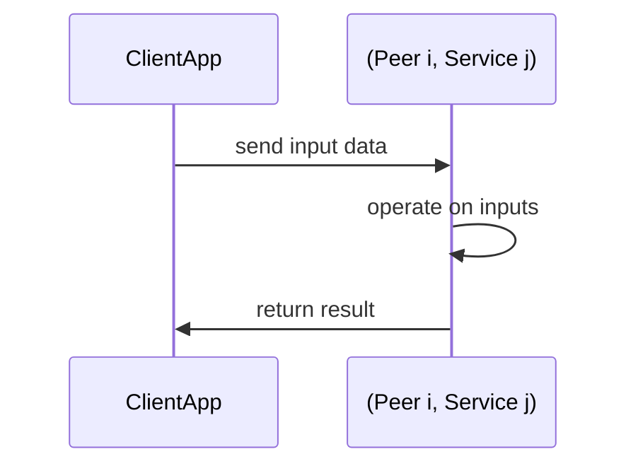
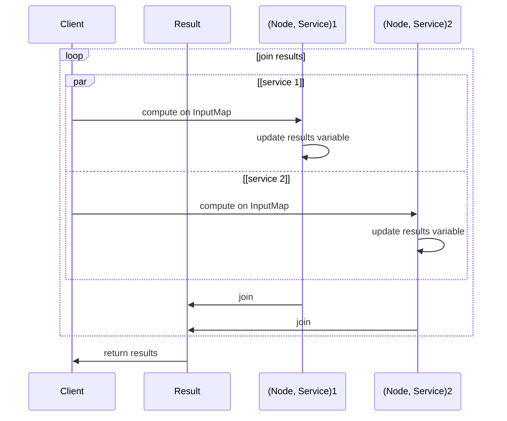

# Aqua Quickstart

Our goal is to create applications from business logic available on different peers of a peer-to-peer network. Most simplistically, that involves sending some data to a distributed service, have that service execute its business logic on the provided data and get the result back to the client.

**Figure 1: Stylized Application From Distributed Services**



In order to accomplish our goal we use [Aqua](https://github.com/fluencelabs/aqua) – an open source programming language purpose-designed to give developers an ergonomic tool to compose applications and backends from services deplyed on peer-to-peer network. For an in-depth introduction to and reference of Aqua, see the [Aqua book](https://doc.fluence.dev/aqua-book/).

For our Tour de Aqua, we use a greeting service which returns either "Hi, {name}" or "Bye, {name}" depending on the values of its signature parameters _name_, a string, and _greet_, a boolean. Armed with that information, we can now write our first Aqua script and get us some distributed greetings.

```aqua
-- greeter.aqua                             --< 1

service Greeting("service-id"):             --< 2
    greeting: string, bool -> string

func greeter(name: string, greet: bool, node: string, service_id: string) -> string:  --< 3
    on node:                                                      
      Greeting service_id
      service_result <- Greeting.greeting(name, greet)
    <- service_result
```

Our script calls a remote service with the parameter values ouf our choice and then directs the result back to our local client application. More specifically,

1. Our file is named *greeter.aqua* and double dashes, `--`, denote an inline **comment**
2. We create an interface function to the remote service
   * _Greeting_ for "service-id", i.e., the id of the remote service, where the keyword **service** denotes a remote service interface
   * with the service function name _greeting_ and input and output types – `string` for the _name_ and `bool` for the _greet_ parameter, respectively, and `string` for the output
3. We create a callable function _greeter_ which
   * takes _name_, _greet_, _node_, _service_ parameters – _name_ and _greet_ are for our remote greeting service and _node_, _service_ are for Aqua to locate the _greeting_ service in the peer-to-peer network
   * specifies the target node hosting the target service, i.e. the node specified by _node_ parameters hosting the _greeting_ service identified by the *service_id* parameter
   * instantiates the _Greeting_ service binding to the provided *service_id* on _node_
   * calls the Greeting service function greeting with the _name_ and _greet_ values which produces the result *service_result*
   * return *service_result* to the local client application
  
You can find the _greeter.aqua_ file in the `../tutorial/sample-code/aqua-scripts` folder. Now that we have our Aqua script, we compile it using the `aqua-cli` compiler. In the *sample-code* directory:

```bash
aqua-cli --input aqua-scripts --output air-scripts -a
```

where `../tutorial/sample-code/aqua-scripts` contains the aqua script we want to compile, i.e., _greeter/aqua_, and the compilation output files go to `../tutorial/sample-code/air-scripts`. Note that with the `-a` flag, the compiler generates aqua intermediary representation (AIR), where as without the flag, the compiler generates a Typescript file with the corresponding AIR embedded. See, for example. the `greeter.ts` file in the `air-script` directory.

Now that we have the compiled script, we can run it from the tutorial directory:

```bash
./sample-code/run-scripts/run_greeter.sh
 ```
 
 Which gives us:

```bash
[
  "Hi, Aqua"
]
```

See the bash file `sample-code/run-scripts/run_greeter.sh` for the data we used to call the service. Congratulations! You have successfully created, compiled and executed your first Aqua script.

In our greeter function, we passed the node and service ids to the *greeter* function:

```aqua
-- greeter.aqua
-- <snip>
func greeter(name: string, greet: bool, node: string, service_id: string) -> string:
    on node:                                                      
      Greeting service_id
      service_result <- Greeting.greeting(name, greet)
    <- service_result
```

To improve both readability and future use of our script, we can create a *NodeServicePair* data type for _node_ and *service id* with the **data** keyword and update the function signature and body accordingly:

 ```aqua
-- greeter_with_struct.aqua
service Greeting("service-id"):
    greeting: string, bool -> string

data NodeServicePair:
  node: string
  service_id: string

func greeter(name: string, greet: bool, host_service:NodeServicePair) -> string:
    on host_service.node:                                                      
      Greeting host_service.service_id
      service_result <- Greeting.greeting(name, greet)
    <- service_result
```

See `sample-code/aqua-scripts/greeter_with_struct.aqua` for the code, which was compiled with the previous _aqua-cli_ compile command to  `sample-code/air-scripts/greeter_with_struct.greeter.air`. Before we can run our new and improved script, we need to update our user data structure to reflect the implementation changes. See `sample-code/run-scripts/run_greeter_with_struct.sh` for the details. Let's run it:

```bash
./sample-code/run-scripts/run_greeter_with_struct.sh
 ```

Which yields the expected result:

 ```bash
[
  "Hi, Aqua"
]
```

Please note that Aqua is weakly typed and provides typechecking. Let's illustrate type checking with a small change to our user data. That is, we replace the boolean value _true_  with the integer 1 — a rather common substitution in some programming languages:

```bash
./sample-code/run-scripts/run_greeter_bad_type.sh
 ```

Which yields an exception due to the type error:

```bash
Something went wrong!
{
  instruction: 'call node (service_id "greeting") [name greet] res',
  msg: 'Local service error, ret_code is 1, error message is \'"Error: arguments from json deserialization error: error Error(\\"invalid type: integer `1`, expected a boolean\\", line: 0, column: 0) occurred while deserialize output result to a json value"\'',
  peer_id: '12D3KooWKnEqMfYo9zvfHmqTLpLdiHXPe4SVqUWcWHDJdFGrSmcA'
}
```

Before we conclude this section and move on to service development with _Marine_, let's expand our data structure like below and *parallelize* the use of the _greeter_ service:

```bash
-- greeter_with_struct_par.aqua
service Greeting("service-id"):
    greeting: string, bool -> string

data InputMap:      --< 1
  node: string
  service_id: string
  name: string
  greet: bool

func greeter(payloads: []InputMap) -> *string:    --< 2
    results: *string      --< 3
    for p <- payloads par:    --< 4                                                   
      on p.node:
        Greeting p.service_id
        service_result <- Greeting.greeting(p.name, p.greet) --< 5
    <- results
```

1. We change our data struct to include all our input params
2. We update our function signature to an **array**, **[]**, of *InputMap*
3. We declare a _results_ stream variable
4. We declare a **for** loop over our array of *InoutMap* and specify that the loop executes in **par**allell
5. We commence as before but join service results in _results_ which we eventually return to our client application

See `sample-code/aqua-scripts/greeter_with_struct_par.aqua` for the code, which was compiled with the previous aqua-cli compile command to  `sample-code/air-scripts/greeter_with_struct_par.greeter.air`. Before we can run our new and improved script, we need to update our user data structure once more to reflect the implementation changes:

```bash
./sample-code/run-scripts/run_greeter_with_struct_par.sh
```

Which results in:

```bash
[
  [
    "Hi, Aqua",
    "Bye, Aqua"
  ]
]
```

As you can see in `sample-code/run-scripts/run_greeter_with_struct_par.sh`, we provided two services instances deployed to different nodes, which allows for parallel processing on the requests. If we had provided only one service instance or two service instances deployed on the same node, the execution flow would have defaulted to sequential processing.

Figure 2: Parallel Processing With Aqua



Well done!! While **par** could have yielded the result in reverse order, we take the lucky hint and move on to the Marine tutorial.
