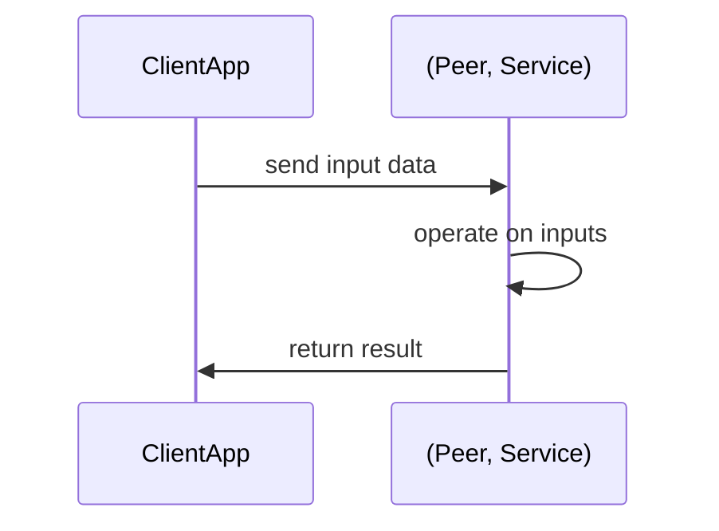

# Aqua Quickstart

Our goal is to create applications from business logic, aka services, available of various peers of a peer-to-peer network. Most simplistically, that involves us wanting to send some data to a service, have that service return the output of executing its business logic on the provided inputs and then manage to get that result back to the client.

Figure 1: Stylized Application From Distributed Services



In order to accomplish our goal, Fluence Labs is offering Aqua: an open source programming language purpose-designed to give developers an ergonomic tool to compose applications from peer-to-peer services.

For the purpose of this section, we will use a greeting service, which returns either "Hi, {name}" or "Bye, {name}" depending on the values of its signature parameters _name_, a string, and _greet_, a boolean. Armed with that information, we can now write our first Aqua script and get us some distributed greetings.

```aqua
-- greeter.aqua                             --< 1

service Greeting("service-id"):             --< 2
    greeting: string, bool -> string

func greeter(name: string, greet: bool, node: string, service_id: string) -> string:  --< 3
    on node:                                                      
      Greeting service_id
      service_result <- Greeting.greeting(name, greet)
    <- service_result
```

As intended, our Aqua script calls a remote service with the parameters ouf our choice and then directs the result back to our local client application. More specifically,

1. Our file is named greeter.aqua and double dashes, **--**, denote a **comment**
2. We create an interface representation of the remote service
   * _Greeting_ for "service-id", i.e., the id of the remote services, where **service** denotes a remote service binding
   * with the service function name _greeting_ and input and output types -- `string` for the _name_ and `bool` for the _greet_ parameter, respectively, and `string` for the output, i.e., service return, value
3. We create a callable function _greeter_ which
   * takes _name_, _greet_ ... _node_, _service_
   * specifies the target node hosting the target service, i.e. the node hosting the _greeting_ service
   * instantiates the _Greeting_ service binding to the provided _service_id_
   * calls the Greeting service function greeting with the _name_ and _greet_ values which produces the result *service_result*
   * return *service_result* to the local client application
  
You can find the _greeter.aqua_ file in the `aqua/sample-code/aqua-scripts` folder. Now that we have our Aqua script, we need to compile it using the `air-cli` tool. In the aqua directory:

```bash
aqua_cli --input sample-code/aqua-scripts --output sample-code/air-scripts -a
```

where `sample-code/aqua-scripts` contains the aqua script we want to compile, i.e., _greeter/aqua_, and the compilation output files got to `sample-code/air-scripts`. Now that we have the compiled script, we can use the command line utility `fldist` to execute the script.

```bash
fldist \
--node-id 12D3KooWKnEqMfYo9zvfHmqTLpLdiHXPe4SVqUWcWHDJdFGrSmcA \
run_air \
-p sample-code/air-scripts/greeter.greeter.air \
 -d '{"service_id":"c9a315de-4fe2-4730-8f40-9209428383bc", "node": "12D3KooWKnEqMfYo9zvfHmqTLpLdiHXPe4SVqUWcWHDJdFGrSmcA", "name": "Aquamarine", "greet": true}' \
 --generated
 ```
 
 With the result:

```bash
 [
  "Hi, Aquamarine"
]
```

We will discuss the `fldist` tool in some detail in the _deploy_ section of this tutorial. Suffice it to say, `fldist` is a command line client that handles the connection to a peer-to-peer network and provides a few utilities including the parameterization of our compiled script with our data. For the call shown above, we provided a json structure with the user data for population of the compiled Aqua script:

```bash
-d '{"service_id":"c9a315de-4fe2-4730-8f40-9209428383bc", "node": "12D3KooWKnEqMfYo9zvfHmqTLpLdiHXPe4SVqUWcWHDJdFGrSmcA", "name": "Aquamarine", "greet": true}'
```

where the

* *node* key provides the peer id of the node hosting the *greeting* service
* *service_id* key provides the identifier of the *greeting* service
* *name* key provides the greeting value
* *greet* key provides the boolean value for the (Hi, Bye) selection

The result

```bash
[
  "Hi, Aquamarine"
]
```

certainly meets our expectations. Make sure to change the greet parameter in the json string to *false* and run the `fldist` command from above again> Now, the result reads:

```bash
[
  "Bye, Aquamarine"
]
```

Congratulations! You have successfully created and compiled your first Aqua script for a deployed service and executed the script with the `fldist` command line tool. Moreover, you modified one of the user data values and once again utilized the deployed service to compute the result.

Aqua is an expressive language extremely well suited for composing distributed services into applications. While a full review of Aqua is beyond the scope of this tutorial, we want to introduce a few more fundamental concepts.

In our greeter func, we passed the node and service ids to the *greeter* function:

```aqua
-- greeter.aqua
-- snip
func greeter(name: string, greet: bool, node: string, service_id: string) -> string:
    on node:                                                      
      Greeting service_id
      service_result <- Greeting.greeting(name, greet)
    <- service_result
```

To improve both readability and future use of our script, we can declare a *NodeServicePair* structure to represent both node and service id and update the function signature and body accordingly:

 ```aqua
-- greeter_better.aqua
service Greeting("service-id"):
    greeting: string, bool -> string

data NodeServicePair:
  node: string
  service_id: string

func greeter(name: string, greet: bool, host_service:NodeServicePair) -> string:
    on host_service.node:                                                      
      Greeting host_service.service_id
      service_result <- Greeting.greeting(name, greet)
    <- service_result
```

See `sample-code/aqua-scripts//greeter_better.aqua` for the code, which was compiled with the previous aqua-cli compile command to  `sample-code/air-scripts//greeter_better.greeter.air`. Before we can run our new and improved script, we need to update our user data structure to reflect the implementation changes:

```bash
fldist \
--node-id 12D3KooWKnEqMfYo9zvfHmqTLpLdiHXPe4SVqUWcWHDJdFGrSmcA \
run_air \
-p sample-code/air-scripts/greeter_better.greeter.air \
 -d '{"host_service":{"service_id":"c9a315de-4fe2-4730-8f40-9209428383bc", "node": "12D3KooWKnEqMfYo9zvfHmqTLpLdiHXPe4SVqUWcWHDJdFGrSmcA"}, "name": "Aquamarine", "greet": false}' \
 --generated
 ```

Which yields the expected result:

 ```bash
[
  "Bye, Aquamarine"
]
```

Please not that Aqua type checks. Let's illustrate type chcking with a small change to our user data. That is, we replace the boolean value _true_  with an int -- a rather common substituion:

```bash
fldist \
--node-id 12D3KooWKnEqMfYo9zvfHmqTLpLdiHXPe4SVqUWcWHDJdFGrSmcA \
run_air \
-p sample-code/air-scripts/greeter_better.greeter.air \
 -d '{"host_service":{"service_id":"c9a315de-4fe2-4730-8f40-9209428383bc", "node": "12D3KooWKnEqMfYo9zvfHmqTLpLdiHXPe4SVqUWcWHDJdFGrSmcA"}, "name": "Aquamarine", "greet": false}' \
 --generated
 ```

Which yields and exception due to the type error:

```bash
Something went wrong!
{
  error: 'Local service error: ret_code is 1, error message is \'"arguments from json deserialization error: error Error(\\"invalid type: integer `0`, expected a boolean\\", line: 0, column: 0) occurred while deserialize output result to a json value\\n\\nLocation:\\n    particle-services/src/app_services.rs:202:51\\n\\n"\'',
  instruction: 'call host_service.$.node! (host_service.$.service_id! "greeting") [name greet] service_result'
}
```

Before we conclude this section and move on to service development, let's expand our data structure like below and *parallelize* the use of the _greeter_ service:

```bash
-- greeter_better_par.aqua
service Greeting("service-id"):
    greeting: string, bool -> string

data InputMap:      --< 1
  node: string
  service_id: string
  name: string
  greet: bool

func greeter(payloads: []InputMap) -> *string:    --< 2
    results: *string      --< 3
    for p <- payloads par:    --< 4                                                   
      on p.node:
        Greeting p.service_id
        service_result <- Greeting.greeting(p.name, p.greet) --< 5
    <- results
```

1. We change our data struct to include all our input params
2. We update our function signature to an **array**, **[]**, of *InputMap*
3. We declare a _results_ stream variable
4. We declare a **for** loop over our array of *InoutMap* and specify that the loop executes in **par**allell
5. We commence as before but join service results in _results_ which we eventually return to our client application

See `sample-code/aqua-scripts//greeter_better_par.aqua` for the code, which was compiled with the previous aqua-cli compile command to  `sample-code/air-scripts//greeter_better_par.greeter.air`. Before we can run our new and improved script, we need to update our user data structure once more to reflect the implementation changes:

```bash
fldist \
--node-id 12D3KooWKnEqMfYo9zvfHmqTLpLdiHXPe4SVqUWcWHDJdFGrSmcA \
run_air \
-p sample-code/air-scripts/greeter_better_par.greeter.air \
 -d '{"data":[{"service_id":"c9a315de-4fe2-4730-8f40-9209428383bc", "node": "12D3KooWKnEqMfYo9zvfHmqTLpLdiHXPe4SVqUWcWHDJdFGrSmcA", "name": "Aqua", "greet": false}, {"service_id":"c9a315de-4fe2-4730-8f40-9209428383bc", "node": "12D3KooWKnEqMfYo9zvfHmqTLpLdiHXPe4SVqUWcWHDJdFGrSmcA", "name": "Marine", "greet": true} ]}' \
 --generated
 ```

Which results in:

```bash
[
  [
    "Bye, Aqua",
    "Hi, Marine"
  ]
]
```

The astute reader will have noticed the different *node* and *service_id* in our second *InputMap*. That is, we are calling upon a second service, ..., deployed on a different node, ..., to allow for the desired parallelization to take place.

Figure 2: Parallel Processing With Aqua


Well done!! While **par** could have yielded a reverse result, we take the lucky hint and move on to the Marine tutorial.
