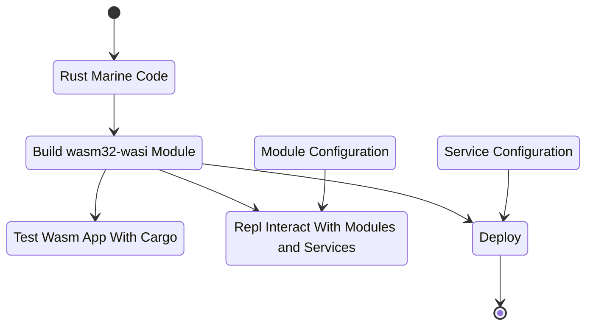

# Marine Quick Start

[Marine](https://github.com/fluencelabs/marine) is Fluence Labs' general purpose Wasm runtime that executes multi-module Wasm Interface Type (IT) applications and the Aqua VM, itself a Wasm module. The Marine runtime is an integral part of every Fluence peer-to-peer reference node and in order to write marine-compatible Wasm IT modules, we use the [marine-rs sdk](https://github.com/fluencelabs/rust-sdk). For a detailed introduction to and reference of Marine and the Fluence solution, see the [Fluence documentation](https://doc.fluence.dev/docs/).

In order to write peer-to-peer services, we need the following tools, which are all available at the container command line:

* Rust: currently he only option to write compatible Marine Wasm modules
* `marine`: the commadn line code builder (think cargo) and Repl tool to create wasm32-wasi modules
* `marine-rs-sdk`: the Rust wasm32-wasi development kit

With these tools, we can turn Rust code into well tested, deployable Wasm modules as illustrated in Figure 2 below.

Figure 2: From Code To Module To Deployment



## Creating A New Project

In your VSCode or container terminal, create a new project with `cargo generate` from the [starter template](https://github.com/boneyard93501/fluence-template). The template provides all the necessary config files, scripts and greeting example in the main.rs code file. Once we understand what's what and why, we can compile to code to the desired wasm32-wasi target, run cargo unit tests and use the MArine Repl to interact with the greeting module.

```bash
root@56892f4726bb:/workspaces/devcontainer# cargo generate -g https://github.com/boneyard93501/fluence-template.git --name greeter
🔧   Creating project called `greeter`...
✨   Done! New project created /workspaces/devcontainer/greeter
root@56892f4726bb:/workspaces/devcontainer#
```

Using `cargo generate` and an exissting template, we initiated a module project call `greeter` which is now visible in the VSCode Explorer with the following directories and files:

* scripts
* src
* Cargo.toml
* Config.toml

Let's unpack.

The Cargo.tom file, see below, is pretty standard Rust fare except for:

```toml
# Cargo.toml
[package]
name = "marine_tutorial"
version = "0.1.0"
authors = ["boneyard93501 <4523011+boneyard93501@users.noreply.github.com>"]
edition = "2018"
description = "marine-tutorial, a Marine wasi module"
license = "Apache-2.0"

[[bin]]                       # <- 1
name = "marine_tutorial"
path = "src/main.rs"

[dependencies]                # <- 2
marine-rs-sdk = { version="0.6.10", features=["logger"]}
log = "0.4.14"

[dev-dependencies]            # <- 3
marine-rs-sdk-test = "0.1.11"

[dev]
[profile.release]
opt-level = "s"
```

1. We need to specify the binary information for our wasm32-wasi compile target
2. We add the [Marine SDK][(https://github.com/fluencelabs/fluence](https://github.com/fluencelabs/marine-rs-sdk)) crate to the dependencies
3. We add the `marine-rs-sdk-test` crate to the development dependencies, which allows us to run `cargo test`
on our Wasm modules as opposed to the native code

The Config.toml file provides the meta data necessary to properly instrument a Wasm IT module for execution by the Marine runtime:

```toml
# Config.toml
modules_dir = "artifacts/"   <-- 1

[[module]]  <-- 2
    name = "greeter"
    mem_pages_count = 1
    logger_enabled = true
```

As illustrated in Figure 2 above, the Config.toml file is required for the local execution of Wasm modules such as the Repl or tests. A Config.toml files consists of:

1. Location of the wasm module to be executed by Marine
2. One or more module specific runtime requirements such as module name, logging particulars, local access and memory allocation, Recall, [Wasm memory](https://webassembly.github.io/spec/core/exec/runtime.html#memory-instances) is allocated in linear pages of 64Ki each.

As evident by the existence of the main.rs file, Marine Wasm modules are created as binaries, where the Marine toolchain compiles our Rust code to the desired wasm32-wasi target. Due to the Wasm Interface Types (IT) target, our Rust files look a little different than general Rust application or even wasm-bindgen code.

```rust
// main.rs
use marine_rs_sdk::{marine, module_manifest, WasmLoggerBuilder};  // <-- 1

module_manifest!();  <-- 2

pub fn main() { // <-- 3
    WasmLoggerBuilder::new().build().ok();  // <-- 4
}

#[marine]  // <-- 5
pub fn greeting(name: String) -> String {  // <-- 6
    format!("Hi, {}", name)
}

#[cfg(test)]
mod tests {
    use fluence_test::marine_test; // <-- 7

    #[marine_test(config_path = "../Config.toml", modules_dir = "../artifacts")]  // <- 8
    fn test_greeting() {
        let name = "Marine";
        let res = greeting.greeting(name.to_string());
        assert_eq!(res, format!("Hi, {}", name));
    }
}
```

1. We import the necessary dependencies as specified in Cargo.toml
2. The module_manifest macro provides the module version, if needed
3. The main function is called when the service is started: first on deploy, and then on every host restart
4. Logging is available
5. Macro enabling and enforcing our wasm32-wasi types for export as module API for a basic greeter function
6. Implementation of exposed, callable Wasm module greeter function 
7. Marine-Test macro to allow testing with the (standard) cargo test tool
8. We run the test against the Wasm not the native code by importing the wasm and config files via the `marine_test macro`. Hence, we need to call the function we want to test from the wasm module in the form `module_name.function_name`, .e.g, `greeting.greeting`.

Now that we got our code and metadata files in place, it's finally time to build our greeting module. Let's start with building our greeting wasm module:

```bash
./scripts/build.sh
```

Which compiles the Rust code to the wasm file greeter.wasm in the artifacts directory. Now we are ready to locally interact with the Wasm module.

To run the test:

```bash
root@56892f4726bb:/workspaces/devcontainer/greeter# cargo +nightly test --release
```

Which should produce the following result:

```bash
   Compiling proc-macro2 v1.0.27
   <snip>
running 1 test
test tests::test_greeting ... ok

test result: ok. 1 passed; 0 failed; 0 ignored; 0 measured; 0 filtered out; finished in 4.39s
```

With the Wasm file in place, we locally interact with the module in the MArine REPL:

```bash
root@56892f4726bb:/workspaces/devcontainer/greeter# marine repl Config.toml   <-- 1
Welcome to the Marine REPL (version 0.8.0)
Minimal supported versions
  sdk: 0.6.0
  interface-types: 0.20.0

app service was created with service id = 41039468-ddc1-4e8a-ad69-bdb63295bdc6
elapsed time 63.403214ms

1> interface                                                                    <-- 2
Loaded modules interface:

greeter:                                                                        <-- 3
  fn greeting(name: String) -> String                                           <-- 4

2>  
```

1. We start the Marine Repl ont he commandlig with the Config.toml, discussed above
2. The `interface` command lists all publicly exposed assets, e.g., modules, functions, structs, etc. for each module
3. The `greeter` module is an addressable Repl namespace 
4. The modules exposed functions, i.e. `fn greeting(name: String) -> String`, which tracks with our source code

In order to interact with our greeting function we use `call` on the module and function with the appropriate parameter type, String in this case, and whatever value(s) you like.

```bash
3> call greeter greeting ["Marine"]
result: String("Hi, Marine")
 elapsed time: 55.098µs

4> call greeter greeting ["World"]
result: String("Hi, World")
 elapsed time: 54.949µs

```

We now have a tested and ready to deploy greeting module. But before we move to the deployment section, let's update the code to fit the Aqua greeter example we encountered earlier and the corresponding test. Update the main.rs file with the greeting and test functions below:

```rust
# main.rs
# snip
#[marine]
pub fn greeting(name: String, greeter: bool) -> String {
    match greeter {
        true => format!("Hi, {}", name),
        false => format!("Bye, {}", name),
    }
}

#[cfg(test)]
mod tests {
    use marine_rs_sdk_test::marine_test;

    #[marine_test(config_path = "../Config.toml", modules_dir = "../artifacts")]
    fn test_greeting() {
        let name = "Marine";

        let res = greeting.greeting(name.to_string(), true);
        assert_eq!(res, format!("Hi, {}", name));

        let res = greeting.greeting(name.clone(), false);
        assert_eq!(res, format!("Bye, {}", name));
    }
}
```

Rebuid the project, `./scripts/build.sh`, and we can inspect our handiwork in the Marine Repl as before:

```bash
Welcome to the Marine REPL (version 0.8.0)
Minimal supported versions
  sdk: 0.6.0
  interface-types: 0.20.0

app service was created with service id = 1b313dae-df52-44bd-81f0-da3419b278c6
elapsed time 47.532658ms

1> i
Loaded modules interface:

greeter:
  fn greeting(name: string, greeter: bool) -> string

2> call greeter greeting ["Marine", true]
result: String("Hi, Marine")
 elapsed time: 136.595µs

3> call greeter greeting ["Marine", false]
result: String("Bye, Marine")
 elapsed time: 73.485µs
```

Now we are ready to move to deployment.
