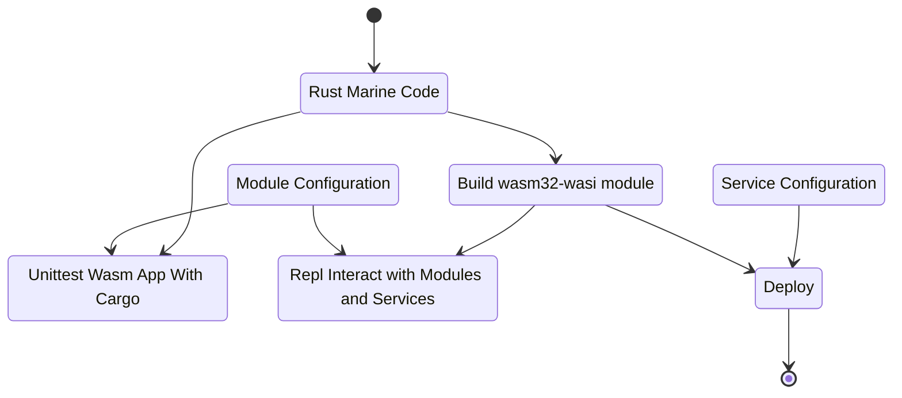

# Marine Quick Start

[Marine](https://github.com/fluencelabs/marine) is Fluence Labs' general purpose Wasm runtime that executes multi-module Wasm applications and the Aqua VM, itself a Wasm module. The Marine runtime is an integral part of every Fluence peer-to-peer reference node and in order to write marine-compatible Wasm IT modules, we use the [marine-rs sdk](https://github.com/fluencelabs/rust-sdk).

In order to write peer-to-peer services, we need the following tools, which are all available at the container command line:

* Rust: currently he only option to write compatible Marine Wasm modules
* Marine: the commadline code builder (think cargo) and Repl tool to create wasm32-wasi modules
* Marine-RS SDK: the Rust wasm32-wasi development kit

With these tools, we can turn Rust code into well tested, deployable Wasm modules as illustrated in Figure 2 below.

Figure 2: From Code To Module To Deployment



## Creating A New Project

In your VSCode or container terminal, create a new project with `cargo generate` from the [starter template](https://github.com/boneyard93501/fluence-template). The template provides all the necessary config files, scripts and greeting example in the main.rs code file. Once we understand what's what and why, we can compile to code to the desired wasm32-wasi target, run cargo unit tests and use the MArine Repl to interact with the greeting module.

```bash
root@56892f4726bb:/workspaces/devcontainer# cargo generate -g https://github.com/boneyard93501/fluence-template.git --name greeter
🔧   Creating project called `greeter`...
✨   Done! New project created /workspaces/devcontainer/greeter
root@56892f4726bb:/workspaces/devcontainer#
```

We initiated a module project call `greeter` which is now visible in the VSCode Explorer with the following directories and files:

* scripts
* src
* Cargo.toml
* Config.toml

Let's unpack.

The Cargo.tom file, see below, is pretty standard Rust fare except for:

1. We need to specify the binary information for our wasm32-wasi compile target
2. We add the [Fluence](https://github.com/fluencelabs/fluence) crate to the dependencies, which includes the marine-rs sdk and the Marine-specific Wasm macros
3. We add the fluence-test crate to the dev dependencies which allows us to write "regular" Rust unit-tests that can be run with `cargo test`

```toml
# Cargo.toml
[package]
name = "greeter"
version = "0.1.0"
authors = ["boneyard93501 <4523011+boneyard93501@users.noreply.github.com>"]
edition = "2018"
description = "greeter, a Marine wasi module"
license = "Apache-2.0"

[[bin]]    <-- 1
name = "greeter"
path = "src/main.rs"

[dependencies] <-- 2
fluence = { version="0.6.9", features=["logger"]}
log = "0.4.14"

[dev-dependencies]  <-- 3
fluence-test = "0.1.9"

[dev]
[profile.release]
opt-level = "s"
```

The Config.toml file provides the meta data necessary to properly instrument a Wasm IT module for execution by the Marine runtime.

```toml
# Config.toml
modules_dir = "artifacts/"   <-- 1

[[module]]  <-- 2
    name = "greeter"
    mem_pages_count = 1
    logger_enabled = true
```

As illustrated in Figure 1 above, the Config.toml file is required for the local execution of Wasm modules such as the Repl or unittests. A Config.toml files consists of:

1. Location of the wasm module to be executed by Marine
2. One or mode module specific runtime requirements such as module name, logging particulars, local access and memory allocation, Recall, [Wasm memory](https://webassembly.github.io/spec/core/exec/runtime.html#memory-instances) is allocated in linear pages of 64Ki each.

As evident by the existence of the main.rs file, Marine Wasm modules are created as binaries and as we see below, the Marine toolchain compiles our Rust code to the desired wasm32-wasi target. Due to the Wasm Interface Types (IT) target, our Rust files look a little different than Rust application or even wasm-bindgen code.

```rust
// main.rs
use fluence::{marine, module_manifest, WasmLoggerBuilder};  // <-- 1

module_manifest!();  <-- 2

pub fn main() { // <-- 3
    WasmLoggerBuilder::new().build().ok();  // <-- 4
}

#[marine]  // <-- 5
pub fn greeting(name: String) -> String {  // <-- 6
    format!("Hi, {}", name)
}

#[cfg(test)]
mod tests {
    use fluence_test::marine_test; // <-- 7

    #[marine_test(config_path = "../Config.toml", modules_dir = "../artifacts")]
    fn test_greeting() {
        let name = "Marine";
        let res = greeting.greeting(name.to_string());
        assert_eq!(res, format!("Hi, {}", name));
    }
}
```

1. We import the necessary dependencies from the fluence crate
2. The module_manifest macro provides the module version, if needed
3. main function is called when service is started: first on deploy, and then on every host restart
4. Logging is available as via this Fluence crate, which is a feature we need to turn on in our Cargo.toml, if desired
5. Macro enabling and enforcing our wasm32-wasi types for export as module API
6. Implementation of exposed, callable Wasm module function
7. Marine-Test macro to allow unit testing with the (standard) cargo test tool

Now that we got our code and metadata files in place, it's finally time to build our greeting module. Let's start with running the unit test:

```rust
root@56892f4726bb:/workspaces/devcontainer/greeter# cargo test --release
warning: unused manifest key: dev
  Downloaded memoffset v0.6.4
  Downloaded strsim v0.10.0
  Downloaded darling_macro v0.12.4
  Downloaded darling v0.12.4
  Downloaded crossbeam-epoch v0.9.5
  Downloaded marine-test-macro v0.1.9
  <snip>
  Finished test [unoptimized + debuginfo] target(s) in 1m 14s
     Running unittests (target/debug/deps/greeter-9d7f45a9b6d1ee65)

running 1 test
test tests::test_greeting ... ok

test result: ok. 1 passed; 0 failed; 0 ignored; 0 measured; 0 filtered out; finished in 4.39s
```

It's time to build our greeting Wasm module for which we use our build script:

```bash
#!/usr/bin/env bash
#
#./scripts/build.sh

mkdir -p artifacts              # <-- 1
rm -f artifacts/*.wasm
marine build --release          # <-- 2
cp target/wasm32-wasi/release/greeter.wasm artifacts/       # <-- 3
```

1. If not already in place´, we create a convenience location for our wasm module(s)
2. Compile the code to a release build
3. Copy the build output, i.e., greeting.wasm, to the artifacts directory.

and run the script:

```bash
.root@56892f4726bb:/workspaces/devcontainer/greeter# ./scripts/build.sh
warning: unused manifest key: dev
    Finished release [optimized] target(s) in 0.10s
root@56892f4726bb:/workspaces/devcontainer/greeter#
```

You can check that the greeting.wasm file has been copied to the artifacts directory:

```bash
root@56892f4726bb:/workspaces/devcontainer/greeter# ls artifacts
greeter.wasm
root@56892f4726bb:/workspaces/devcontainer/greeter# 
```

And now we are ready to interact with the module with the help of Config.toml in Marine Repl:

```bash
root@56892f4726bb:/workspaces/devcontainer/greeter# marine repl Config.toml   <-- 1
Welcome to the Marine REPL (version 0.7.2)
Minimal supported versions
  sdk: 0.6.0
  interface-types: 0.20.0

app service was created with service id = 41039468-ddc1-4e8a-ad69-bdb63295bdc6
elapsed time 63.403214ms

1> interface                                                                    <-- 2
Loaded modules interface:

greeter:                                                                        <-- 3
  fn greeting(name: String) -> String                                           <-- 4

2>  
```

1. We start the Marine Repl ont he commandlig with the Config.toml, discussed above
2. The `interface` command lists all publicly exposed assets, e.g., modules, functions, structs, etc. for each module
3. The `greeter` module is an addressable Repl namespace 
4. The modules exposed functions, i.e. `fn greeting(name: String) -> String` 

In order to interact with our greeting function we use `call` on the module and function with the appropriate parameter type, String in this case, and whatever value(s) you like.

```bash
3> call greeter greeting ["Fluence"]
result: String("Hi, Fluence")
 elapsed time: 55.098µs

4> call greeter greeting ["Marine"]
result: String("Hi, Marine")
 elapsed time: 54.949µs

5>
```

We now have a tested and ready to deploy greeting module. But before we move to the deployment section, let's update the code to fit the Aqua greeter example we encountered earlier and the corresponding unit test:

```rust
# main.rs
# snip
#[marine]
pub fn greeting(name: String, greeter: bool) -> String {
    match greeter {
        true => format!("Hi, {}", name),
        false => format!("Bye, {}", name),
    }
}

#[cfg(test)]
mod tests {
    use fluence_test::marine_test;

    #[marine_test(config_path = "../Config.toml", modules_dir = "../artifacts")]
    fn test_greeting() {
        let name = "Marine";

        let res = greeting.greeting(name.to_string(), true);
        assert_eq!(res, format!("Hi, {}", name));

        let res = greeting.greeting(name.clone(), false);
        assert_eq!(res, format!("Bye, {}", name));
    }
}
```

Rebuid the project, `./scripts/build.sh`, and we can inspect our handiwork in the Marine Repl as before:

```bash
root@56892f4726bb:/workspaces/devcontainer/greeter# marine repl Config.toml
Welcome to the Marine REPL (version 0.7.2)
Minimal supported versions
  sdk: 0.6.0
  interface-types: 0.20.0

app service was created with service id = 50752835-9ad5-4664-9c01-4587dc194763
elapsed time 67.519592ms

1> interface
Loaded modules interface:

greeter:
  fn greeting(name: String, greeter: Boolean) -> String

2> call greeter greeting ["Marine", true]
result: String("Hi, Marine")
 elapsed time: 71.039µs

3> call greeter greeting ["Marine", false]
result: String("Bye, Marine")
 elapsed time: 60.644µs

4> 
```

Now we are ready to move to deployment.
